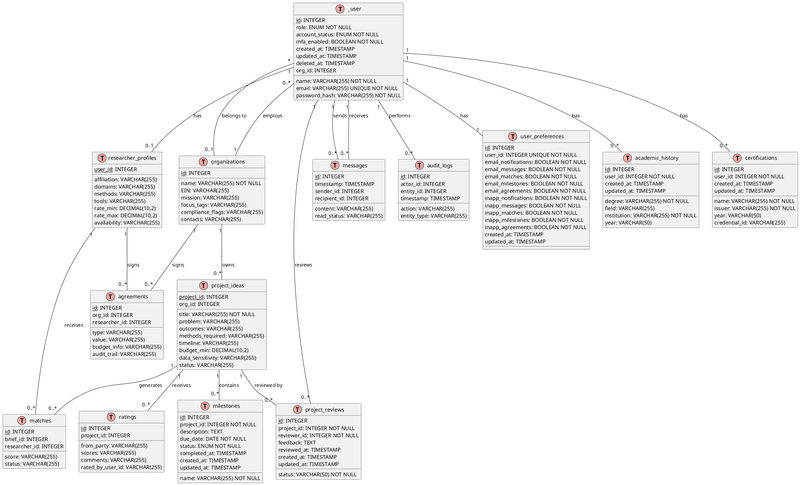

# TRIDENT Match Portal - Database UML Specification

**Version**: 2.0  
**Date**: December 2, 2025  
**Status**: Production Ready  
**Total Tables**: 14  
**Total Associations**: 18

---

## Table of Contents
1. [Entity Overview](#entity-overview)
2. [Complete Table Specifications](#complete-table-specifications)
3. [Entity Relationships](#entity-relationships)
4. [UML Class Diagram Notation](#uml-class-diagram-notation)
5. [Database Constraints](#database-constraints)
6. [Indexes and Performance](#indexes-and-performance)
7. [PlantUML Diagram Code](#plantuml-diagram-code)

---

## Entity Overview

### Core Entities (14 Tables)

| Table Name | Purpose | Relationships | Records |
|------------|---------|---------------|---------|
| `_user` | User authentication and authorization | 1:1 ResearcherProfile, 1:1 UserPreferences, 1:M Messages, 1:M AuditLogs, M:1 Organization | Primary |
| `organizations` | Nonprofit organization profiles | 1:M Projects, 1:M Applications, 1:M Users | Secondary |
| `researcher_profiles` | Researcher professional profiles | 1:M Matches, 1:M Applications | Secondary |
| `project_ideas` | Project briefs from nonprofits | 1:M Milestones, 1:M Matches, 1:M Ratings, 1:M ProjectReviews | Primary |
| `milestones` | Project milestone tracking | M:1 Project | Secondary |
| `agreements` | Collaboration agreements/NDAs | M:1 Organization, M:1 ResearcherProfile | Primary |
| `matches` | Matching results (researcher-project) | M:1 Project, M:1 ResearcherProfile | Primary |
| `ratings` | Post-project reviews and ratings | M:1 Project | Secondary |
| `messages` | Inter-party messaging | M:1 User (sender), M:1 User (recipient) | Secondary |
| `audit_logs` | System audit trail | M:1 User (actor) | Secondary |
| `user_preferences` | Notification preferences | 1:1 User | Secondary |
| `project_reviews` | Admin moderation reviews | M:1 Project, M:1 User (reviewer) | Secondary |
| `academic_history` | Researcher academic credentials | M:1 User | Secondary |
| `certifications` | Researcher certifications | M:1 User | Secondary |

---

## Complete Table Specifications

### 1. _user (Users)

**Purpose**: Core user authentication and authorization  
**Primary Key**: `id` (INTEGER, AUTO_INCREMENT)  
**Soft Delete**: YES (paranoid mode with `deleted_at`)

#### Columns

| Column | Type | Constraints | Default | Description |
|--------|------|-------------|---------|-------------|
| `id` | INTEGER | PRIMARY KEY, AUTO_INCREMENT, NOT NULL | - | Unique user identifier |
| `name` | VARCHAR(255) | NOT NULL | - | Full name |
| `email` | VARCHAR(255) | UNIQUE, NOT NULL | - | Email (normalized to lowercase) |
| `password_hash` | VARCHAR(255) | NOT NULL | - | bcrypt hashed password (10 rounds) |
| `role` | ENUM | NOT NULL | 'researcher' | User role: researcher, nonprofit, admin |
| `account_status` | ENUM | NOT NULL | 'active' | Account status: active, pending, suspended |
| `mfa_enabled` | BOOLEAN | NOT NULL | false | Multi-factor auth enabled flag |
| `created_at` | TIMESTAMP | NOT NULL | CURRENT_TIMESTAMP | Account creation timestamp |
| `updated_at` | TIMESTAMP | NOT NULL | CURRENT_TIMESTAMP | Last update timestamp |
| `deleted_at` | TIMESTAMP | NULL | NULL | Soft delete timestamp (paranoid) |
| `org_id` | INTEGER | FOREIGN KEY, NULL | NULL | Organization ID for nonprofit users |

#### Constraints
- **UNIQUE**: `email`
- **ENUM** `role`: ('researcher', 'nonprofit', 'admin')
- **ENUM** `account_status`: ('active', 'pending', 'suspended')
- **FOREIGN KEY**: `org_id` REFERENCES `organizations(id)` ON DELETE SET NULL

#### Validation (Sequelize Model)
- `name`: notEmpty, len[1, 255]
- `email`: isEmail, notEmpty, lowercase
- `password_hash`: notEmpty
- `role`: isIn(['researcher', 'nonprofit', 'admin'])

#### Indexes
- PRIMARY KEY on `id`
- UNIQUE INDEX on `email`
- INDEX on `org_id`
- INDEX on `deleted_at` (for paranoid queries)

---

### 2. organizations (Organizations)

**Purpose**: Nonprofit organization profiles  
**Primary Key**: `id` (INTEGER, AUTO_INCREMENT)  
**Soft Delete**: NO

#### Columns

| Column | Type | Constraints | Default | Description |
|--------|------|-------------|---------|-------------|
| `id` | INTEGER | PRIMARY KEY, AUTO_INCREMENT, NOT NULL | - | Unique organization identifier |
| `name` | VARCHAR(255) | NOT NULL | - | Organization name |
| `EIN` | VARCHAR(255) | NULL | NULL | Employer Identification Number |
| `mission` | VARCHAR(255) | NULL | NULL | Organization mission statement |
| `focus_tags` | VARCHAR(255) | NULL | NULL | Focus areas (comma-separated) |
| `compliance_flags` | VARCHAR(255) | NULL | NULL | Compliance status flags |
| `contacts` | VARCHAR(255) | NULL | NULL | Contact information |

#### Constraints
- None (all columns nullable except id, name)

#### Validation (Sequelize Model)
- `name`: notEmpty, len[1, 255]

#### Indexes
- PRIMARY KEY on `id`

#### Notes
- No timestamps for this table
- Used by nonprofit users only
- One organization can have multiple users (org_id in _user table)

---

### 3. researcher_profiles (Researcher Profiles)

**Purpose**: Professional profiles for researcher users  
**Primary Key**: `user_id` (INTEGER, FOREIGN KEY)  
**Soft Delete**: NO

#### Columns

| Column | Type | Constraints | Default | Description |
|--------|------|-------------|---------|-------------|
| `user_id` | INTEGER | PRIMARY KEY, FOREIGN KEY, NOT NULL | - | Links to _user.id |
| `affiliation` | VARCHAR(255) | NULL | NULL | Academic/institutional affiliation |
| `domains` | VARCHAR(255) | NULL | NULL | Research domains (comma-separated) |
| `methods` | VARCHAR(255) | NULL | NULL | Research methods (comma-separated) |
| `tools` | VARCHAR(255) | NULL | NULL | Tools/technologies (comma-separated) |
| `rate_min` | DECIMAL(10,2) | NULL | NULL | Minimum hourly rate |
| `rate_max` | DECIMAL(10,2) | NULL | NULL | Maximum hourly rate |
| `availability` | VARCHAR(255) | NULL | NULL | Availability status |

#### Constraints
- **PRIMARY KEY**: `user_id`
- **FOREIGN KEY**: `user_id` REFERENCES `_user(id)` ON DELETE CASCADE ON UPDATE CASCADE

#### Validation (Sequelize Model)
- `rate_min`: isDecimal, min(0)
- `rate_max`: isDecimal, min(0)

#### Indexes
- PRIMARY KEY on `user_id`

#### Notes
- No timestamps for this table
- One-to-one relationship with _user
- Created automatically on researcher registration

---

### 4. project_ideas (Projects)

**Purpose**: Project briefs created by nonprofits  
**Primary Key**: `project_id` (INTEGER, AUTO_INCREMENT)  
**Soft Delete**: NO

#### Columns

| Column | Type | Constraints | Default | Description |
|--------|------|-------------|---------|-------------|
| `project_id` | INTEGER | PRIMARY KEY, AUTO_INCREMENT, NOT NULL | - | Unique project identifier |
| `title` | VARCHAR(255) | NOT NULL | - | Project title |
| `problem` | VARCHAR(255) | NULL | NULL | Problem statement |
| `outcomes` | VARCHAR(255) | NULL | NULL | Desired outcomes |
| `methods_required` | VARCHAR(255) | NULL | NULL | Required research methods |
| `timeline` | VARCHAR(255) | NULL | NULL | Project timeline |
| `budget_min` | DECIMAL(10,2) | NULL | NULL | Minimum budget |
| `data_sensitivity` | VARCHAR(255) | NULL | NULL | Data sensitivity level |
| `status` | VARCHAR(255) | NULL | 'draft' | Project status |
| `org_id` | INTEGER | FOREIGN KEY, NULL | NULL | Organization owner |

#### Constraints
- **FOREIGN KEY**: `org_id` REFERENCES `organizations(id)` ON DELETE CASCADE ON UPDATE CASCADE

#### Validation (Sequelize Model)
- `title`: notEmpty, len[1, 255]
- `budget_min`: isDecimal, min(0) (if provided)

#### Indexes
- PRIMARY KEY on `project_id`
- INDEX on `org_id`
- INDEX on `status`

#### Notes
- No built-in timestamps (can be extended)
- Status field can be: draft, pending_review, approved, published, in_progress, completed, archived

---

### 5. milestones (Milestones)

**Purpose**: Track project progress with deliverable milestones  
**Primary Key**: `id` (INTEGER, AUTO_INCREMENT)  
**Soft Delete**: NO

#### Columns

| Column | Type | Constraints | Default | Description |
|--------|------|-------------|---------|-------------|
| `id` | INTEGER | PRIMARY KEY, AUTO_INCREMENT, NOT NULL | - | Unique milestone identifier |
| `project_id` | INTEGER | FOREIGN KEY, NOT NULL | - | Associated project |
| `name` | VARCHAR(255) | NOT NULL | - | Milestone name |
| `description` | TEXT | NULL | NULL | Detailed description |
| `due_date` | DATE | NOT NULL | - | Due date |
| `status` | ENUM | NOT NULL | 'pending' | Milestone status |
| `completed_at` | TIMESTAMP | NULL | NULL | Completion timestamp |
| `created_at` | TIMESTAMP | NOT NULL | CURRENT_TIMESTAMP | Creation timestamp |
| `updated_at` | TIMESTAMP | NOT NULL | CURRENT_TIMESTAMP | Last update timestamp |

#### Constraints
- **FOREIGN KEY**: `project_id` REFERENCES `project_ideas(project_id)` ON DELETE CASCADE ON UPDATE CASCADE
- **ENUM** `status`: ('pending', 'in_progress', 'completed', 'cancelled')

#### Validation (Sequelize Model)
- `name`: notEmpty, len[1, 255]
- `due_date`: isDate, notNull
- `status`: isIn(['pending', 'in_progress', 'completed', 'cancelled'])

#### Indexes
- PRIMARY KEY on `id`
- INDEX on `project_id`
- INDEX on `status`
- INDEX on `due_date`

#### Computed Fields (Application Layer)
- `is_overdue`: Boolean (due_date < today AND status != 'completed')
- `days_until_due`: Integer (days between today and due_date)

---

### 6. agreements (Agreements/Applications)

**Purpose**: Collaboration agreements between nonprofits and researchers  
**Primary Key**: `id` (INTEGER, AUTO_INCREMENT)  
**Soft Delete**: NO

#### Columns

| Column | Type | Constraints | Default | Description |
|--------|------|-------------|---------|-------------|
| `id` | INTEGER | PRIMARY KEY, AUTO_INCREMENT, NOT NULL | - | Unique agreement identifier |
| `type` | VARCHAR(255) | NULL | NULL | Agreement type (NDA, DUA, etc.) |
| `value` | VARCHAR(255) | NULL | NULL | Agreement value/amount |
| `budget_info` | VARCHAR(255) | NULL | NULL | Budget breakdown |
| `audit_trail` | VARCHAR(255) | NULL | NULL | Audit trail JSON |
| `org_id` | INTEGER | FOREIGN KEY, NULL | NULL | Organization party |
| `researcher_id` | INTEGER | FOREIGN KEY, NULL | NULL | Researcher party |

#### Constraints
- **FOREIGN KEY**: `org_id` REFERENCES `organizations(id)` ON DELETE SET NULL
- **FOREIGN KEY**: `researcher_id` REFERENCES `researcher_profiles(user_id)` ON DELETE SET NULL

#### Indexes
- PRIMARY KEY on `id`
- INDEX on `org_id`
- INDEX on `researcher_id`

#### Notes
- No timestamps for this table
- Future: Add e-signature integration fields
- Future: Add status field (pending, signed, active, completed, terminated)

---

### 7. matches (Matches)

**Purpose**: Store matching results between researchers and projects  
**Primary Key**: `id` (INTEGER, AUTO_INCREMENT)  
**Soft Delete**: NO

#### Columns

| Column | Type | Constraints | Default | Description |
|--------|------|-------------|---------|-------------|
| `id` | INTEGER | PRIMARY KEY, AUTO_INCREMENT, NOT NULL | - | Unique match identifier |
| `score` | VARCHAR(255) | NULL | NULL | Matching score/rank |
| `status` | VARCHAR(255) | NULL | NULL | Match status |
| `brief_id` | INTEGER | FOREIGN KEY, NULL | NULL | Project brief |
| `researcher_id` | INTEGER | FOREIGN KEY, NULL | NULL | Matched researcher |

#### Constraints
- **FOREIGN KEY**: `brief_id` REFERENCES `project_ideas(project_id)` ON DELETE SET NULL
- **FOREIGN KEY**: `researcher_id` REFERENCES `researcher_profiles(user_id)` ON DELETE SET NULL

#### Indexes
- PRIMARY KEY on `id`
- INDEX on `brief_id`
- INDEX on `researcher_id`
- INDEX on `status`

#### Notes
- No timestamps for this table
- Future: Add matching_algorithm_version, created_at, expires_at
- Status can be: pending, accepted, rejected, expired

---

### 8. ratings (Ratings/Reviews)

**Purpose**: Post-project ratings and feedback  
**Primary Key**: `id` (INTEGER, AUTO_INCREMENT)  
**Soft Delete**: NO

#### Columns

| Column | Type | Constraints | Default | Description |
|--------|------|-------------|---------|-------------|
| `id` | INTEGER | PRIMARY KEY, AUTO_INCREMENT, NOT NULL | - | Unique rating identifier |
| `from_party` | VARCHAR(255) | NULL | NULL | Rating source (nonprofit/researcher) |
| `scores` | VARCHAR(255) | NULL | NULL | Rating scores JSON |
| `comments` | VARCHAR(255) | NULL | NULL | Written feedback |
| `project_id` | INTEGER | FOREIGN KEY, NULL | NULL | Rated project |
| `rated_by_user_id` | VARCHAR(255) | NULL | NULL | User who submitted rating |

#### Constraints
- **FOREIGN KEY**: `project_id` REFERENCES `project_ideas(project_id)` ON DELETE SET NULL

#### Indexes
- PRIMARY KEY on `id`
- INDEX on `project_id`

#### Notes
- No timestamps for this table
- Future: Change rated_by_user_id to INTEGER FOREIGN KEY
- Future: Add rating dimensions (communication, quality, timeliness, etc.)

---

### 9. messages (Messages)

**Purpose**: Direct messaging between users  
**Primary Key**: `id` (INTEGER, AUTO_INCREMENT)  
**Soft Delete**: NO

#### Columns

| Column | Type | Constraints | Default | Description |
|--------|------|-------------|---------|-------------|
| `id` | INTEGER | PRIMARY KEY, AUTO_INCREMENT, NOT NULL | - | Unique message identifier |
| `content` | VARCHAR(255) | NULL | NULL | Message content |
| `timestamp` | TIMESTAMP | NULL | CURRENT_TIMESTAMP | Message sent time |
| `read_status` | VARCHAR(255) | NULL | 'unread' | Read status |
| `sender_id` | INTEGER | FOREIGN KEY, NULL | NULL | Sender user |
| `recipient_id` | INTEGER | FOREIGN KEY, NULL | NULL | Recipient user |

#### Constraints
- **FOREIGN KEY**: `sender_id` REFERENCES `_user(id)` ON DELETE SET NULL
- **FOREIGN KEY**: `recipient_id` REFERENCES `_user(id)` ON DELETE SET NULL

#### Indexes
- PRIMARY KEY on `id`
- INDEX on `sender_id`
- INDEX on `recipient_id`
- INDEX on `timestamp`
- INDEX on `read_status`

#### Notes
- Future: Add thread_id for conversation grouping
- Future: Add message_type (text, file, system)
- Future: Implement real-time with Socket.IO

---

### 10. audit_logs (Audit Logs)

**Purpose**: System-wide audit trail for security and compliance  
**Primary Key**: `id` (INTEGER, AUTO_INCREMENT)  
**Soft Delete**: NO

#### Columns

| Column | Type | Constraints | Default | Description |
|--------|------|-------------|---------|-------------|
| `id` | INTEGER | PRIMARY KEY, AUTO_INCREMENT, NOT NULL | - | Unique log identifier |
| `actor_id` | INTEGER | FOREIGN KEY, NULL | NULL | User who performed action |
| `action` | VARCHAR(255) | NULL | NULL | Action performed |
| `entity_type` | VARCHAR(255) | NULL | NULL | Affected entity type |
| `entity_id` | INTEGER | NULL | NULL | Affected entity ID |
| `timestamp` | TIMESTAMP | NULL | CURRENT_TIMESTAMP | Action timestamp |

#### Constraints
- **FOREIGN KEY**: `actor_id` REFERENCES `_user(id)` ON DELETE SET NULL

#### Indexes
- PRIMARY KEY on `id`
- INDEX on `actor_id`
- INDEX on `entity_type`
- INDEX on `timestamp`

#### Notes
- No updates (append-only log)
- Future: Add ip_address, user_agent, changes_json fields

---

### 11. user_preferences (User Preferences)

**Purpose**: User notification and display preferences  
**Primary Key**: `id` (INTEGER, AUTO_INCREMENT)  
**Soft Delete**: NO

#### Columns

| Column | Type | Constraints | Default | Description |
|--------|------|-------------|---------|-------------|
| `id` | INTEGER | PRIMARY KEY, AUTO_INCREMENT, NOT NULL | - | Unique preference identifier |
| `user_id` | INTEGER | UNIQUE, FOREIGN KEY, NOT NULL | - | Associated user |
| `email_notifications` | BOOLEAN | NOT NULL | true | Master email toggle |
| `email_messages` | BOOLEAN | NOT NULL | true | Email for new messages |
| `email_matches` | BOOLEAN | NOT NULL | true | Email for new matches |
| `email_milestones` | BOOLEAN | NOT NULL | true | Email for milestone updates |
| `email_agreements` | BOOLEAN | NOT NULL | true | Email for agreement updates |
| `inapp_notifications` | BOOLEAN | NOT NULL | true | Master in-app toggle |
| `inapp_messages` | BOOLEAN | NOT NULL | true | In-app for new messages |
| `inapp_matches` | BOOLEAN | NOT NULL | true | In-app for new matches |
| `inapp_milestones` | BOOLEAN | NOT NULL | true | In-app for milestones |
| `inapp_agreements` | BOOLEAN | NOT NULL | true | In-app for agreements |
| `created_at` | TIMESTAMP | NOT NULL | CURRENT_TIMESTAMP | Creation timestamp |
| `updated_at` | TIMESTAMP | NOT NULL | CURRENT_TIMESTAMP | Last update timestamp |

#### Constraints
- **UNIQUE**: `user_id`
- **FOREIGN KEY**: `user_id` REFERENCES `_user(id)` ON DELETE CASCADE ON UPDATE CASCADE

#### Indexes
- PRIMARY KEY on `id`
- UNIQUE INDEX on `user_id`

#### Notes
- Auto-created with default values when user registers
- One-to-one relationship with _user

---

### 12. project_reviews (Project Reviews)

**Purpose**: Admin moderation reviews of project briefs  
**Primary Key**: `id` (INTEGER, AUTO_INCREMENT)  
**Soft Delete**: NO

#### Columns

| Column | Type | Constraints | Default | Description |
|--------|------|-------------|---------|-------------|
| `id` | INTEGER | PRIMARY KEY, AUTO_INCREMENT, NOT NULL | - | Unique review identifier |
| `project_id` | INTEGER | FOREIGN KEY, NOT NULL | - | Reviewed project |
| `reviewer_id` | INTEGER | FOREIGN KEY, NOT NULL | - | Admin who reviewed |
| `status` | VARCHAR(50) | NOT NULL | 'pending' | Review status |
| `feedback` | TEXT | NULL | NULL | Admin feedback/notes |
| `reviewed_at` | TIMESTAMP | NULL | NULL | Review completion time |
| `created_at` | TIMESTAMP | NOT NULL | CURRENT_TIMESTAMP | Review request time |
| `updated_at` | TIMESTAMP | NOT NULL | CURRENT_TIMESTAMP | Last update time |

#### Constraints
- **FOREIGN KEY**: `project_id` REFERENCES `project_ideas(project_id)` ON DELETE CASCADE
- **FOREIGN KEY**: `reviewer_id` REFERENCES `_user(id)` ON DELETE SET NULL

#### Validation (Sequelize Model)
- `status`: isIn(['pending', 'approved', 'rejected', 'changes_requested'])

#### Indexes
- PRIMARY KEY on `id`
- INDEX on `project_id`
- INDEX on `reviewer_id`
- INDEX on `status`

#### Notes
- Used for UC10: Moderate Project Briefs
- Status flow: pending → approved/rejected/changes_requested

---

### 13. academic_history (Academic History)

**Purpose**: Store researcher academic credentials and education  
**Primary Key**: `id` (INTEGER, AUTO_INCREMENT)  
**Soft Delete**: NO

#### Columns

| Column | Type | Constraints | Default | Description |
|--------|------|-------------|---------|-------------|
| `id` | INTEGER | PRIMARY KEY, AUTO_INCREMENT, NOT NULL | - | Unique credential identifier |
| `user_id` | INTEGER | FOREIGN KEY, NOT NULL | - | Associated researcher user |
| `degree` | VARCHAR(255) | NOT NULL | - | Degree type (PhD, MS, BS, etc.) |
| `field` | VARCHAR(255) | NULL | NULL | Field of study |
| `institution` | VARCHAR(255) | NOT NULL | - | Educational institution |
| `year` | VARCHAR(50) | NULL | NULL | Graduation year/range |
| `created_at` | TIMESTAMP | NOT NULL | CURRENT_TIMESTAMP | Record creation time |
| `updated_at` | TIMESTAMP | NOT NULL | CURRENT_TIMESTAMP | Last update time |

#### Constraints
- **FOREIGN KEY**: `user_id` REFERENCES `_user(id)` ON DELETE CASCADE ON UPDATE CASCADE

#### Validation (Sequelize Model)
- `degree`: notEmpty
- `institution`: notEmpty

#### Indexes
- PRIMARY KEY on `id`
- INDEX on `user_id`

#### Notes
- One user can have multiple academic entries
- Year field accepts flexible formats (e.g., "2023", "2020-2024", "Expected 2025")

---

### 14. certifications (Certifications)

**Purpose**: Store researcher professional certifications  
**Primary Key**: `id` (INTEGER, AUTO_INCREMENT)  
**Soft Delete**: NO

#### Columns

| Column | Type | Constraints | Default | Description |
|--------|------|-------------|---------|-------------|
| `id` | INTEGER | PRIMARY KEY, AUTO_INCREMENT, NOT NULL | - | Unique certification identifier |
| `user_id` | INTEGER | FOREIGN KEY, NOT NULL | - | Associated researcher user |
| `name` | VARCHAR(255) | NOT NULL | - | Certification name |
| `issuer` | VARCHAR(255) | NOT NULL | - | Issuing organization |
| `year` | VARCHAR(50) | NULL | NULL | Year obtained |
| `credential_id` | VARCHAR(255) | NULL | NULL | Credential/license ID |
| `created_at` | TIMESTAMP | NOT NULL | CURRENT_TIMESTAMP | Record creation time |
| `updated_at` | TIMESTAMP | NOT NULL | CURRENT_TIMESTAMP | Last update time |

#### Constraints
- **FOREIGN KEY**: `user_id` REFERENCES `_user(id)` ON DELETE CASCADE ON UPDATE CASCADE

#### Validation (Sequelize Model)
- `name`: notEmpty
- `issuer`: notEmpty

#### Indexes
- PRIMARY KEY on `id`
- INDEX on `user_id`

#### Notes
- One user can have multiple certifications
- credential_id is optional (some certifications don't have IDs)

---

## Entity Relationships

### Complete Relationship Map

```
_user (Users)
├── hasOne → researcher_profiles (1:1)
├── hasOne → user_preferences (1:1)
├── hasMany → academic_history (1:M)
├── hasMany → certifications (1:M)
├── hasMany → messages (as sender) (1:M)
├── hasMany → messages (as recipient) (1:M)
├── hasMany → audit_logs (1:M)
├── hasMany → project_reviews (as reviewer) (1:M)
└── belongsTo → organizations (M:1, via org_id)

organizations (Organizations)
├── hasMany → _user (nonprofit users) (1:M)
├── hasMany → project_ideas (1:M)
└── hasMany → agreements (1:M)

researcher_profiles (Researcher Profiles)
├── belongsTo → _user (1:1)
├── hasMany → matches (1:M)
└── hasMany → agreements (1:M)

project_ideas (Projects)
├── belongsTo → organizations (M:1)
├── hasMany → milestones (1:M)
├── hasMany → matches (1:M)
├── hasMany → ratings (1:M)
└── hasMany → project_reviews (1:M)

milestones (Milestones)
└── belongsTo → project_ideas (M:1)

agreements (Agreements)
├── belongsTo → organizations (M:1)
└── belongsTo → researcher_profiles (M:1)

matches (Matches)
├── belongsTo → project_ideas (M:1)
└── belongsTo → researcher_profiles (M:1)

ratings (Ratings)
└── belongsTo → project_ideas (M:1)

messages (Messages)
├── belongsTo → _user (as sender) (M:1)
└── belongsTo → _user (as recipient) (M:1)

audit_logs (Audit Logs)
└── belongsTo → _user (as actor) (M:1)

user_preferences (User Preferences)
└── belongsTo → _user (1:1)

project_reviews (Project Reviews)
├── belongsTo → project_ideas (M:1)
└── belongsTo → _user (as reviewer) (M:1)

academic_history (Academic History)
└── belongsTo → _user (M:1)

certifications (Certifications)
└── belongsTo → _user (M:1)
```

### Relationship Details

#### One-to-One (1:1)
1. **User ↔ ResearcherProfile**
   - Foreign Key: `researcher_profiles.user_id` → `_user.id`
   - Cascade: DELETE CASCADE, UPDATE CASCADE
   - Purpose: Professional profile for researcher users only

2. **User ↔ UserPreferences**
   - Foreign Key: `user_preferences.user_id` → `_user.id`
   - Cascade: DELETE CASCADE, UPDATE CASCADE
   - Purpose: User-specific notification settings

#### One-to-Many (1:M)
1. **Organization → Projects**
   - Foreign Key: `project_ideas.org_id` → `organizations.id`
   - Cascade: DELETE CASCADE, UPDATE CASCADE
   - Purpose: One org owns many projects

2. **Organization → Users** (Nonprofit users)
   - Foreign Key: `_user.org_id` → `organizations.id`
   - Cascade: DELETE SET NULL
   - Purpose: Multiple users can belong to one org

3. **Project → Milestones**
   - Foreign Key: `milestones.project_id` → `project_ideas.project_id`
   - Cascade: DELETE CASCADE, UPDATE CASCADE
   - Purpose: Project broken into multiple milestones

4. **Project → Matches**
   - Foreign Key: `matches.brief_id` → `project_ideas.project_id`
   - Cascade: DELETE SET NULL
   - Purpose: One project matched to multiple researchers

5. **Project → Ratings**
   - Foreign Key: `ratings.project_id` → `project_ideas.project_id`
   - Cascade: DELETE SET NULL
   - Purpose: Multiple reviews per project

6. **Project → ProjectReviews**
   - Foreign Key: `project_reviews.project_id` → `project_ideas.project_id`
   - Cascade: DELETE CASCADE
   - Purpose: Admin moderation history

7. **ResearcherProfile → Matches**
   - Foreign Key: `matches.researcher_id` → `researcher_profiles.user_id`
   - Cascade: DELETE SET NULL
   - Purpose: One researcher matched to multiple projects

8. **ResearcherProfile → Agreements**
   - Foreign Key: `agreements.researcher_id` → `researcher_profiles.user_id`
   - Cascade: DELETE SET NULL
   - Purpose: Researcher can have multiple agreements

9. **Organization → Agreements**
   - Foreign Key: `agreements.org_id` → `organizations.id`
   - Cascade: DELETE SET NULL
   - Purpose: Organization can have multiple agreements

10. **User → Messages** (as sender)
    - Foreign Key: `messages.sender_id` → `_user.id`
    - Cascade: DELETE SET NULL
    - Purpose: User sends multiple messages

11. **User → Messages** (as recipient)
    - Foreign Key: `messages.recipient_id` → `_user.id`
    - Cascade: DELETE SET NULL
    - Purpose: User receives multiple messages

12. **User → AuditLogs**
    - Foreign Key: `audit_logs.actor_id` → `_user.id`
    - Cascade: DELETE SET NULL
    - Purpose: Track all user actions

13. **User → ProjectReviews** (as reviewer)
    - Foreign Key: `project_reviews.reviewer_id` → `_user.id`
    - Cascade: DELETE SET NULL
    - Purpose: Admin reviews multiple projects

14. **User → AcademicHistory**
    - Foreign Key: `academic_history.user_id` → `_user.id`
    - Cascade: DELETE CASCADE
    - Purpose: Researcher has multiple degrees

15. **User → Certifications**
    - Foreign Key: `certifications.user_id` → `_user.id`
    - Cascade: DELETE CASCADE
    - Purpose: Researcher has multiple certifications

---

## UML Class Diagram Notation

### Class Structure (for each table)

```
┌────────────────────────────┐
│      TableName             │ ← Class name
├────────────────────────────┤
│ - id: INTEGER (PK)         │ ← Primary key
│ - column1: TYPE            │ ← Attributes
│ - column2: TYPE            │
│ - foreign_key: INTEGER (FK)│ ← Foreign keys
│ - created_at: TIMESTAMP    │
│ - updated_at: TIMESTAMP    │
├────────────────────────────┤
│ + create()                 │ ← Methods (CRUD)
│ + findById(id)             │
│ + update()                 │
│ + delete()                 │
└────────────────────────────┘
```

### Relationship Notation

```
One-to-One (1:1):
ClassA ──────── ClassB
  1               1

One-to-Many (1:M):
ClassA ──────── ClassB
  1              0..*

Many-to-Many (M:M):
ClassA ──────── ClassB
  0..*          0..*
```

### Cardinality Symbols
- `1` - Exactly one
- `0..1` - Zero or one (optional)
- `0..*` - Zero or many
- `1..*` - One or many
- `*` - Many

---

## Database Constraints

### Primary Keys
All tables have auto-incrementing INTEGER primary keys except:
- `researcher_profiles`: Uses `user_id` as primary key (foreign key from _user)

### Foreign Key Constraints Summary

| From Table | From Column | To Table | To Column | On Delete | On Update |
|------------|-------------|----------|-----------|-----------|-----------|
| `_user` | `org_id` | `organizations` | `id` | SET NULL | CASCADE |
| `researcher_profiles` | `user_id` | `_user` | `id` | CASCADE | CASCADE |
| `user_preferences` | `user_id` | `_user` | `id` | CASCADE | CASCADE |
| `academic_history` | `user_id` | `_user` | `id` | CASCADE | CASCADE |
| `certifications` | `user_id` | `_user` | `id` | CASCADE | CASCADE |
| `project_ideas` | `org_id` | `organizations` | `id` | CASCADE | CASCADE |
| `milestones` | `project_id` | `project_ideas` | `project_id` | CASCADE | CASCADE |
| `agreements` | `org_id` | `organizations` | `id` | SET NULL | - |
| `agreements` | `researcher_id` | `researcher_profiles` | `user_id` | SET NULL | - |
| `matches` | `brief_id` | `project_ideas` | `project_id` | SET NULL | - |
| `matches` | `researcher_id` | `researcher_profiles` | `user_id` | SET NULL | - |
| `ratings` | `project_id` | `project_ideas` | `project_id` | SET NULL | - |
| `messages` | `sender_id` | `_user` | `id` | SET NULL | - |
| `messages` | `recipient_id` | `_user` | `id` | SET NULL | - |
| `audit_logs` | `actor_id` | `_user` | `id` | SET NULL | - |
| `project_reviews` | `project_id` | `project_ideas` | `project_id` | CASCADE | - |
| `project_reviews` | `reviewer_id` | `_user` | `id` | SET NULL | - |

### Unique Constraints
- `_user.email` - UNIQUE (prevent duplicate accounts)
- `user_preferences.user_id` - UNIQUE (one preference set per user)

### ENUM Constraints
- `_user.role` - ENUM('researcher', 'nonprofit', 'admin')
- `_user.account_status` - ENUM('active', 'pending', 'suspended')
- `milestones.status` - ENUM('pending', 'in_progress', 'completed', 'cancelled')

### NOT NULL Constraints
Core identifying fields are NOT NULL:
- All primary keys
- All foreign keys marked as NOT NULL
- User: name, email, password_hash, role, account_status
- Organization: name
- Project: title
- Milestone: project_id, name, due_date, status
- Academic: user_id, degree, institution
- Certification: user_id, name, issuer

---

## Indexes and Performance

### Primary Indexes (Automatic)
All tables have B-tree index on primary key.

### Foreign Key Indexes
All foreign keys automatically indexed for JOIN performance:
- `_user.org_id`
- `researcher_profiles.user_id`
- `user_preferences.user_id`
- `academic_history.user_id`
- `certifications.user_id`
- `project_ideas.org_id`
- `milestones.project_id`
- `agreements.org_id`, `agreements.researcher_id`
- `matches.brief_id`, `matches.researcher_id`
- `ratings.project_id`
- `messages.sender_id`, `messages.recipient_id`
- `audit_logs.actor_id`
- `project_reviews.project_id`, `project_reviews.reviewer_id`

### Additional Indexes for Query Performance

#### Status-Based Queries
- `milestones.status` - Filter by milestone status
- `milestones.due_date` - Sort by due date, find overdue
- `project_ideas.status` - Filter projects by status
- `matches.status` - Filter matches by status

#### Time-Based Queries
- `messages.timestamp` - Sort messages chronologically
- `audit_logs.timestamp` - Audit log queries by time range
- `_user.deleted_at` - Paranoid mode soft delete queries

#### Search Queries
- `_user.email` - UNIQUE index doubles as search index
- `audit_logs.entity_type` - Filter logs by entity

### Performance Considerations
- **Paranoid Mode**: `_user.deleted_at` indexed for efficient filtering of active vs deleted users
- **Composite Indexes**: Future consideration for common query patterns
  - `(milestones.project_id, milestones.status)` for project-specific status queries
  - `(messages.recipient_id, messages.read_status)` for unread message counts

---

## PlantUML Diagram Code



### How to Generate Diagram

1. **Online Tool**: Copy the PlantUML code to [PlantText.com](https://www.planttext.com/) or [PlantUML Online Editor](http://www.plantuml.com/plantuml/uml/)

2. **VS Code**: Install "PlantUML" extension and preview the diagram

3. **Command Line**:
   ```bash
   plantuml DATABASE_UML_SPECIFICATION.md
   ```

4. **Export Formats**: PNG, SVG, PDF, ASCII

---

## Migration History

### Applied Migrations (14 Total)

1. `20251118205457-create-user-table.js` - Core user table with auth fields
2. `20251125000001-create-organizations-table.js` - Nonprofit profiles
3. `20251125000002-create-researcher-profiles-table.js` - Researcher profiles
4. `20251125000003-create-projects-table.js` - Project briefs
5. `20251125000004-create-matches-table.js` - Matching results
6. `20251125000005-create-ratings-table.js` - Post-project reviews
7. `20251125000006-create-milestones-table.js` - Project milestones
8. `20251125000007-create-agreements-table.js` - Collaboration agreements
9. `20251125000008-create-messages-table.js` - Inter-party messaging
10. `20251125000009-create-audit-logs-table.js` - Audit trail
11. `20251125000010-create-user-preferences-table.js` - Notification settings
12. `20251126120001-add-account-status-to-user.js` - Account status field
13. `20251126000011-create-project-reviews-table.js` - Admin moderation
14. `20251201230000-create-academic-history-and-certifications.js` - Academic credentials

### Database State
- ✅ All migrations applied successfully
- ✅ All foreign keys created with proper constraints
- ✅ All indexes created for performance
- ✅ Paranoid mode enabled on _user table
- ✅ ENUM types validated at database level

---

## Data Integrity Rules

### Cascade Delete Chains

**When User is Deleted (Soft)**:
- `_user.deleted_at` is set (paranoid mode)
- Related data is preserved (researcher_profiles, preferences, etc.)
- Future queries exclude deleted users automatically

**When User is Permanently Deleted**:
- ResearcherProfile CASCADE deleted
- UserPreferences CASCADE deleted
- AcademicHistory CASCADE deleted
- Certifications CASCADE deleted
- Messages SET NULL (sender_id, recipient_id)
- AuditLogs SET NULL (actor_id) - preserves audit trail
- ProjectReviews SET NULL (reviewer_id)

**When Organization is Deleted**:
- All Projects CASCADE deleted
- All Milestones CASCADE deleted (via projects)
- All Matches SET NULL
- All Ratings SET NULL
- All Agreements SET NULL
- Associated Users SET NULL (org_id)

**When Project is Deleted**:
- All Milestones CASCADE deleted
- All Matches SET NULL
- All Ratings SET NULL
- All ProjectReviews CASCADE deleted

### Referential Integrity
- No orphaned records allowed for CASCADE constraints
- Audit trails preserved with SET NULL constraints
- Soft deletes (paranoid) prevent accidental data loss for users

---

## Security Considerations

### Sensitive Data
- `_user.password_hash` - Never expose in API responses (use toSafeObject())
- `_user.deleted_at` - Filter automatically with paranoid mode
- `audit_logs` - Append-only, immutable after creation

### Data Privacy
- Researchers: academic_history, certifications, researcher_profiles
- Nonprofits: organizations, EIN
- Messages: Direct user communication (implement encryption in future)

### Access Control
- Role-based: researcher, nonprofit, admin
- Account status: active, pending, suspended
- Ownership: Users can only modify their own data
- Organization isolation: Nonprofits see only their projects/milestones

---

## Future Enhancements

### Planned Schema Changes
1. **Matching Algorithm Tables**
   - `match_criteria` - Store matching weights and rules
   - `match_history` - Track algorithm performance over time

2. **E-Signature Integration**
   - Add `agreements.signature_researcher`, `agreements.signature_nonprofit`
   - Add `agreements.signed_at`, `agreements.signed_ip`

3. **File Storage**
   - `file_uploads` table for project documents
   - Link to projects, milestones, messages

4. **Real-Time Messaging**
   - Add `message_threads` table
   - Add `message_type` ENUM (text, file, system)
   - Integrate WebSocket/Socket.IO

5. **Advanced Audit Logging**
   - Add `audit_logs.ip_address`
   - Add `audit_logs.user_agent`
   - Add `audit_logs.changes_json` (before/after state)

6. **Enhanced User Features**
   - Add `_user.profile_picture_url`
   - Add `_user.last_login_at`
   - Add `_user.email_verified_at`

---

## Conclusion

This UML specification provides a complete blueprint for the TRIDENT Match Portal database schema. All 14 tables are documented with full column specifications, relationships, constraints, and indexes. The schema supports the complete use case requirements with proper data integrity, security, and performance optimization.

**Key Strengths**:
- ✅ Comprehensive relationship mapping (18 associations)
- ✅ Proper foreign key constraints with CASCADE rules
- ✅ Soft delete support (paranoid mode on users)
- ✅ ENUM validation at database level
- ✅ Performance indexes on all foreign keys and search columns
- ✅ Security-first design (password hashing, audit trails)
- ✅ Scalable architecture (ready for matching algorithm, messaging, file uploads)

**Total Database Objects**:
- 14 Tables
- 18 Foreign Key Relationships
- 3 One-to-One Relationships
- 15 One-to-Many Relationships
- 50+ Indexed Columns
- 3 ENUM Types

---

*End of Database UML Specification*
